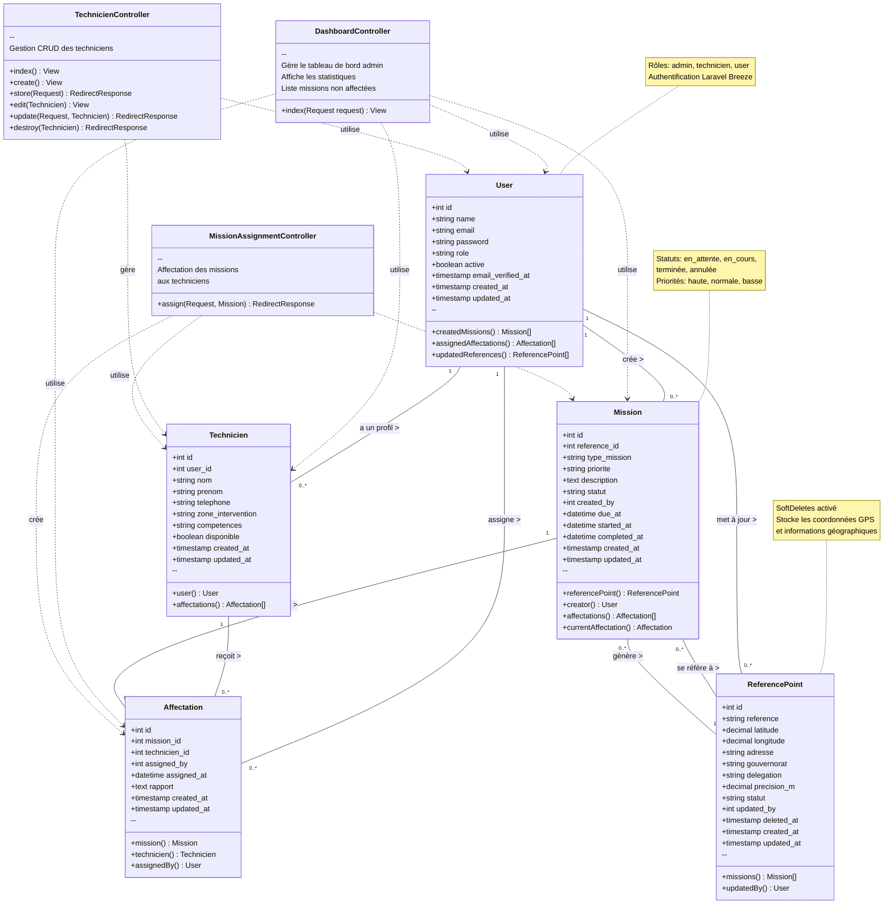

# Diagramme de Classes - Interface Admin

## Architecture de l'Application

## Description des Entités

### 1. User (Utilisateur)
- **Rôle** : Gestion de l'authentification et des autorisations
- **Types** : admin, technicien, user
- **Relations** :
  - Crée des missions
  - Peut être associé à un profil technicien
  - Assigne des missions via affectations

### 2. Technicien
- **Rôle** : Représente un technicien de terrain
- **Attributs clés** : zone_intervention, competences, disponible
- **Relations** :
  - Lié à un utilisateur (User)
  - Reçoit des affectations de missions

### 3. Mission
- **Rôle** : Tâche à accomplir sur un point de référence
- **Statuts** : en_attente, en_cours, terminée, annulée
- **Priorités** : haute, normale, basse
- **Relations** :
  - Créée par un User
  - Référence un ReferencePoint
  - A des affectations

### 4. Affectation
- **Rôle** : Lie une mission à un technicien
- **Fonction** : Trace qui a affecté quelle mission à quel technicien et quand
- **Relations** :
  - Appartient à une Mission
  - Appartient à un Technicien
  - Créée par un User (assigned_by)

### 5. ReferencePoint
- **Rôle** : Point de référence géographique (infrastructure STEG)
- **Données géographiques** : latitude, longitude, précision
- **SoftDeletes** : Les suppressions sont logiques
- **Relations** :
  - Génère des missions
  - Mise à jour par un User

## Contrôleurs Admin

### DashboardController
- Affiche les statistiques (nombre d'utilisateurs, techniciens, missions)
- Liste les missions non affectées
- Permet l'affectation rapide des missions

### TechnicienController
- CRUD complet pour la gestion des techniciens
- Création/édition/suppression de profils techniciens

### MissionAssignmentController
- Gère l'affectation des missions aux techniciens
- Crée les enregistrements d'affectation

## Flux de Travail Admin

1. **Création de mission** → Un admin crée une mission liée à un ReferencePoint
2. **Affectation** → L'admin assigne la mission à un technicien disponible via le dashboard
3. **Suivi** → Le dashboard affiche les statistiques et missions non affectées
4. **Gestion techniciens** → CRUD complet via TechnicienController

## Autorisations

- **Gate** : `access-admin` contrôle l'accès au dashboard admin
- **Policy** : `manage-missions` contrôle la création de missions
- Basé sur le champ `role` de la table `users`
